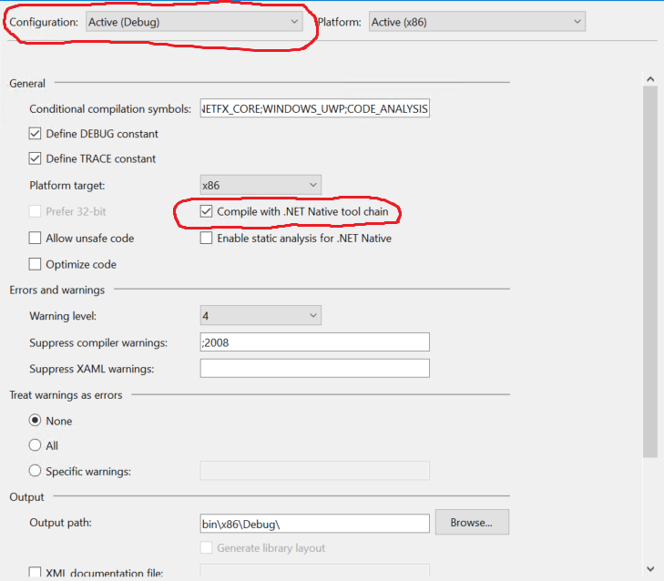
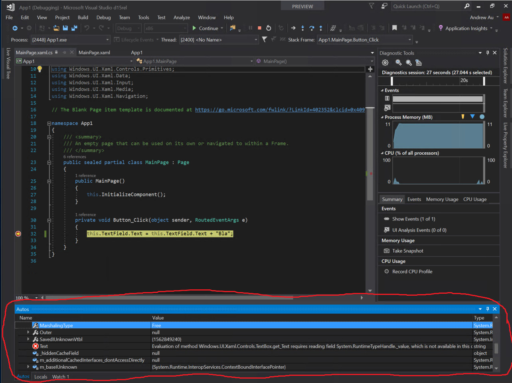
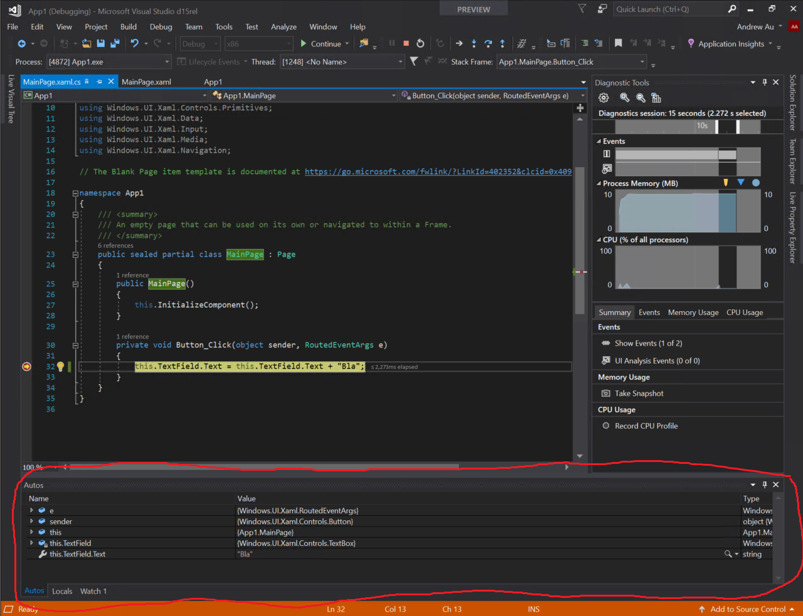

# .NET Native 2.0 Function Evaluation Debugger Support (Preview)

As part of the [.NET Native 2.0 release](README.md), we have shipped a preview of the FuncEval feature that aims to improve diagnostics and overall debugging experience for UWP Applications compiled with the .NET Native 2.0 toolchain.  Please note that since this is only a public preview of the feature, it is turned off by default and can be turned on by setting a registry key.  Once FuncEval support is enabled, you should be able to inspect WinRT Properties under the debugger, that you previously could not.

## How to use Function Evaluation (FuncEval) in Visual Studio 2017 15.4

1. Start by creating a blank UWP Application
2. Switch the application to use **Debug Configuration** and select **Compile with .NET Native tool chain** in the project property page 

    
    
3. Create a TextBox and a Button and then write the following code :
    ```private void Button_Click(object sender, RoutedEventArgs e)
    {
        this.TextField.Text = this.TextField.Text + "Blah";
    }
    ```
4. Set a breakpoint in the Button_Click event handler
    - Inspecting the ```this.TextField.Text``` will report ```Evaluation of method Windows.UI.Xaml.Controls.TextBox.get_Text requires reading field.System.RuntimeTypeHandle._value, which is not available in this context.```
    
    
    
5. Now enable FuncEval support by setting the NetNativeFuncEvalEnabled registry key
    - Open a command prompt and execute:
        - ```"C:\Program Files (x86)\Microsoft Visual Studio\Enterprise\Common7\IDE\VsRegEdit.exe" set "C:\Program Files (x86)\Microsoft Visual Studio\Enterprise" HKCU Debugger NetNativeFuncEvalEnabled DWORD 1```
        - Note that you will have to change the Visual Studio Path (```"C:\Program Files (x86)\Microsoft\Visual Studio\Enterprise"```) to match your local environment.

6. There is no need to close or restart Visual Studio, just run the command and debug again.  Now the debugger autos menu will show you the contents of this.TextField.Text:



## How to disable Function Evaluation (FuncEval) in Visual Studio 2017 15.4

- If the FuncEval preview is causing any problems, you can turn it off by changing the registry key value to zero (0)
    - Open a command prompt and execute:
        - ```"C:\Program Files (x86)\Microsoft Visual Studio\Enterprise\Common7\IDE\VsRegEdit.exe" set "C:\Program Files (x86)\Microsoft Visual Studio\Enterprise" HKCU Debugger NetNativeFuncEvalEnabled DWORD 0```
        - Again, you will have to change the Visual Studio Path (```"C:\Program Files (x86)\Microsoft\Visual Studio\Enterprise"```) to match your local environment.


## Windows.UI.Xaml.UnhandledExceptionEventArgs

One particular property that developers really want to inspect is the Exception field on the Windows.UI.Xaml.UnhandledExceptionEventArgs object.  To do so, add the following to your Default.rd.xml:

```
    <!-- Add your application specific runtime directives here. -->
    <Namespace Name="Windows.UI.Xaml">
      <Type Name="UnhandledExceptionEventArgs">
        <Property Name="Exception" Dynamic="Required" />
      </Type>
    </Namespace>
```

With the Default.rd.xml setup and the FuncEval feature enabled you can inspect the expection object now.  In general, this approach should work for all properties that you would like to inspect.

## Known Issues

- The FuncEval Preview currently does not support inspection of generic functions or properties.

## Provide Feedback

Please continue to send questions and suggestions to dotnetnative@microsoft.com.  We look forward to hearing from you and seeing what great things you will build.
